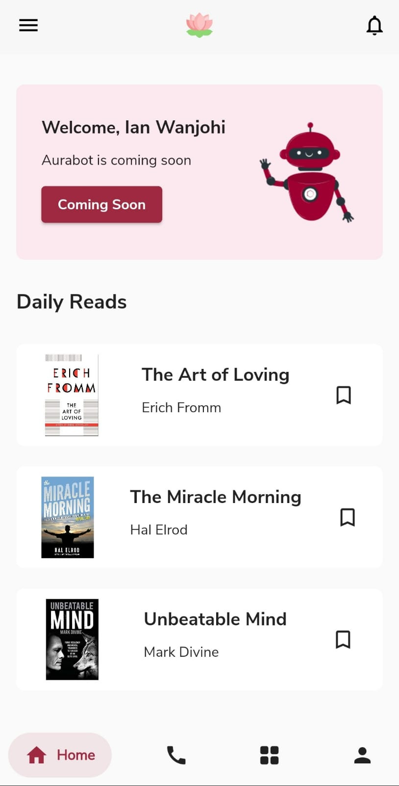
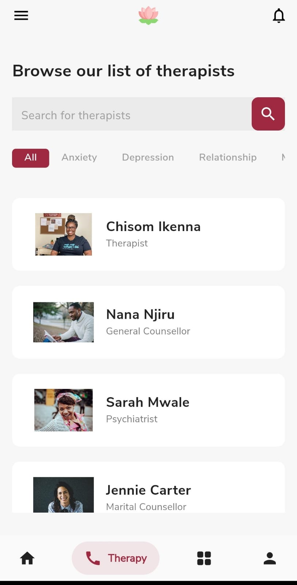
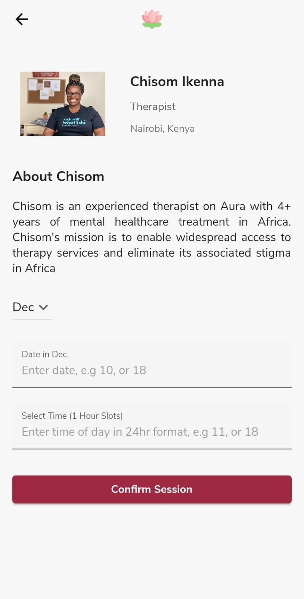
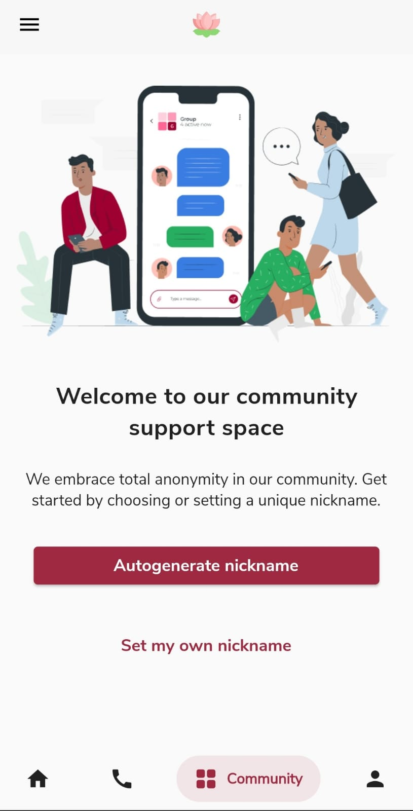

# Aura

## Problem Statement

The stigma and limited access to mental healthcare services amongst Africans have led to a rise in mental health problems, such as depression, anxiety, stress and addiction amongst different social groups. Despite the increased number of people struggling with mental health, very few have tried to access resources or help. There is a need to make mental healthcare resources and support more convenient and affordable for more people to access.

## Our Solution

Aura is a mobile application that offers a wide range of affordable mental healthcare support services, e.g. counselling, community, a chatbot and access to self-help resources. 

## MVP Features

- User registration and login
- Booking a therapy session
- Viewing and filtering therapists based on categories
- Autogenerate or set a nickname to join our community spaces
- Creating a community space and viewing it on the community space home
- Joining a community space

## Application in Action

We created the mobile application using Flutter. Below are some screenshots of the pages in the application.

### Home Page

### Therapist Page

### Therapist Information

### Community Spaces - Nicknames

## How to test Aura

- Clone this repository
- Ensure you are running the latest version of Flutter
- Connect your mobile device via USB or use an Android Emulator.
- Inside your terminal type "flutter run"
- Wait for the app to install on your device and use Aura.

## Contact Us

For any queries contact [Ian Kamanu Wanjohi](https://ianwanjohi.netlify.app/), [Ziithe Ewen Hiwa](https://www.ziitheewen.com/) or [Abakar Issa](mailto:m.abakar@alustudent.com)
